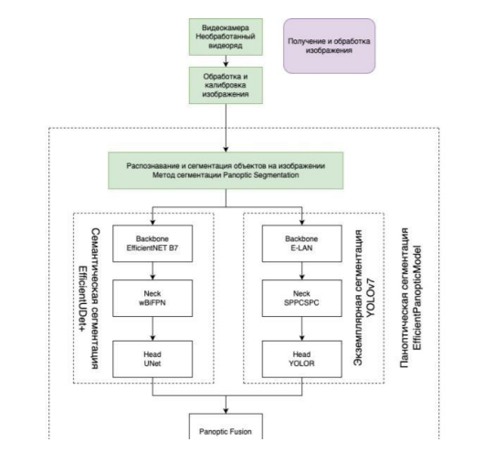
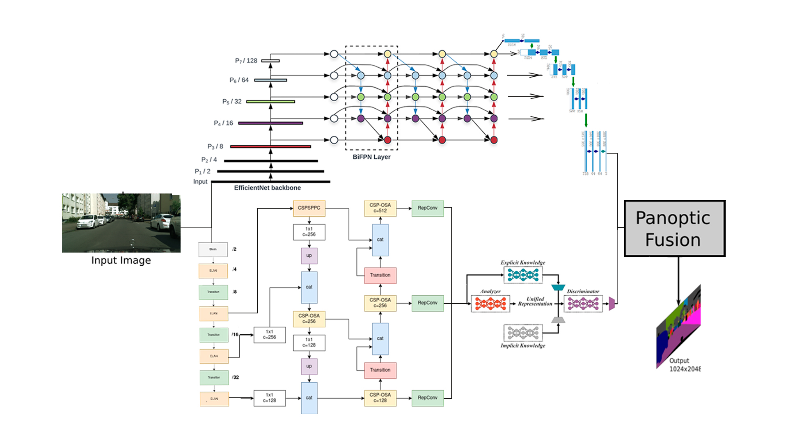
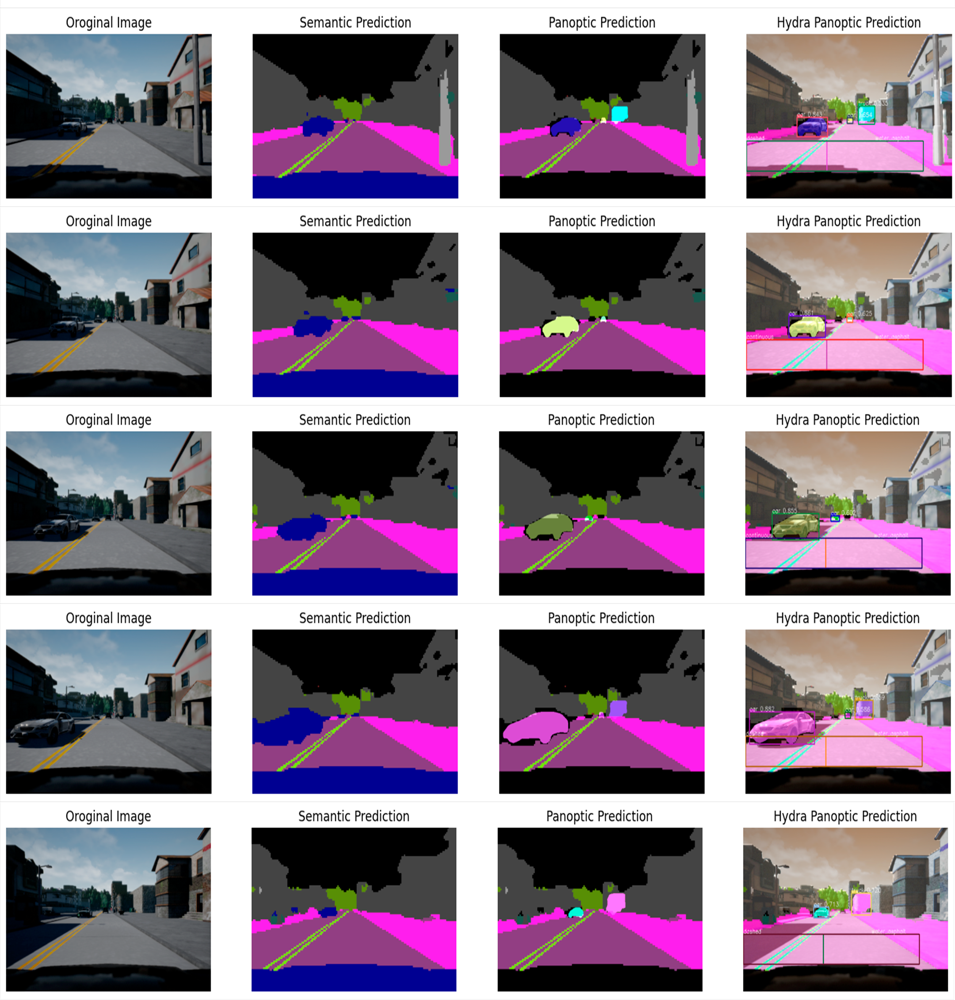

# EfficientPanopticModel
Модель паноптической сегментации (Иллюстрация статьи)

----
### Установка YOLOv7 и Pytorch
- ! pip install pyyaml==5.1
- ! pip install 'git+https://github.com/facebookresearch/detectron2.git'
- ! pip install torch==1.10.1+cu113 torchvision==0.11.2+cu113 torchaudio==0.10.1 -f https://download.pytorch.org/whl/torch_stable.html
----
Для усовершенствования и увеличения точности работы модели было принято решение взять за основу методологию разработки наиболее эффективных алгоритмов паноптической сегментации и заменить структурные части более продвинутыми, что позволило составить единый алгоритм, способный устранить все недостатки предыдущих поколений. 
Таким образом была разработана структурная схема алгоритма паноптической сегментации «EfficientPanopticModel», представленная на рисунке 1.

 
Рис.1. Структурная схема разработанного алгоритма

В основу разработки архитектуры данной модели легла совокупность методологий разработки двух наилучших алгоритмов паноптической сегментации.  Для получения наивысшего показателя точности работы алгоритма было принято решение взять две независимые модели, как это реализовано в алгоритме M-RCNN + PSPNet, а для устранения проблемы наложения масок использовать для объединения финальных предсказаний метод слияния, подобный тому, что применяется в архитектуре EffcientPS. 

Алгоритм «YOLOV7»
 В качестве первого независимого алгоритма инстанс сегментации было принято решение взять алгоритм YOLOv7 [9], способный в значительной степени сократить время на обработку изображения, а также значительно повлиять на финальный показатель качества модели. 
Алгоритм инстанс сегментации состоит из Backbone алгоритма: нейросети E-LAN, Neck алгоритма – SPPCSPC, и головы YOLOR.  Особенностью работы данного алгоритма является наличие техники «Re-parameterization», объединяющей слои свертки и слои пакетной нормализации, а также присутствие в работе алгоритма неявных знаний. Данный алгоритм имеет наивысший показатель скорости обработки информации среди аналогов, а также наименьшую задержку в работе. 

Алгоритм «EfficientUDet»
В качестве алгоритма семантической сегментации была использована архитектура EfficientUDet [1]. В данной архитектуре в качестве энкодера выступают алгоритмы семейства EfficientNet, что в значительной степени повышает общую производительность алгоритма.  На этапе “Skip-connections” применен промежуточный блок, представляющий собой пирамидальную нейросеть wBiFPN, что позволяет разбивать изображение на несколько фрагментов разного разрешения и масштаба с целью извлечения уникальных признаков. А в качестве декодера использована архитектура UNet, которая объединяет как функции высокого уровня, так и пространственную информацию низкого уровня для более точной сегментации.
Подобный метод реализации модели значительно сокращает число обучаемых параметров, повышает скорость работы алгоритма и снижает нагрузку на вычислительные процессоры, что дает возможность обрабатывать изображения в большем масштабе и, в свою очередь, положительно сказывается на финальном показателе точности работы. 

Блок паноптического слияния «Panoptic Fusion»
Блок «Panoptic Fusion» является заключительным блоком в теле разрабатываемого алгоритма и предназначен для объединения результата работы алгоритмов семантической и экземплярной сегментаций. 
Первым этапом блок получает набор экземпляров объекта из алгоритма сегментации. Сначала происходит отсеивание всех экземпляров объектов, показатель достоверности которых меньше определенного порога достоверности. Затем выполняется процедура изменения размера и масштабирования. 
Вторым этапом, алгоритм получает семантические логиты из алгоритма семантической сегментации. Выполняется вычисление второй логит маски MLB для каждого экземпляра, где выбор канала семантических логитов происходит на основе его предсказания класса. 
Третьим этапом выполняется проверка логитов маски каждого отсортированного экземпляра на пересечение с другими экземплярами объекта. Для этого вычисляется сигмоида логитов маски и устанавливается пороговое значение. Если перекрытие между двоичными масками превышает заданный порог, логиты маски с наивысшей достоверностью сохраняются, а другие отбрасываются. 
В итоге алгоритм имеет два логита маски для каждого объекта и экземпляра, один из головы экземалярной сегментации MLA, а другой MLB — из головы семантической сегментации. Финальным этапом алгоритм адаптивно комбинирует полученные логиты маски. Это позволяет получить окончательный результат паноптической сегментации. 
Финальная архитектура разработанной нейронной сети представлена на рисунке 2. 

 
Рис. 2. Архитектура алгоритма EfficientPanopticModel

## Оценка эффективности разработанного проекта

Таблица 1. Сравнение показателей качества работы разработанного алгоритма паноптической сегментации EfficientPanopticModel с существующими
Наименование модели |PQ, % | AP, % | IoU, %
------------- | ------ | ------ | ------
Axial-DeepLab-L	| 41.1	| -	| 68,4
WeaklySupervised	| 47,3	| 24,3	| 71,6
DINetwork	| 55,4	| -	| 79,8
TASCNet	| 55,9	| -	| -
DeeperLab	| 56,3	| -	| -
**EfficientPanopticModel**	| **57,11**	| **-** | **73,64**
Panoptic FPN	| 58,1	| 33,0	| 75,7
AUNet	| 59,0	| 34,4	| 75,6
UPSNet	| 59,3	| 33,3	| 75,2
Seamless	| 60,3	| 33,6	| 77,5
SSAP	| 61,1	| -	| -
AdaptIS	| 62,0	| 36,3	| 79,2
Panoptic-DeepLab	| 67,1	| 35,3	| 80,5
OneFormer	| 67,6	| -	| 83,1
EfficientPS	| 67,8	| 38,3	| 79,3
M-RCNN + PSPNet	| 61,2	| 36,4	| 80,9

На рисунке 3 представлена визуализация результатов выполнения паноптической сегментации разработанной архитектурой EfficientPanopticModel. Для демонстрации работы модели был использован симулятор тестирования систем автономного вождения CARLA. 

 
Рис. 3. Результат работы алгоритма EfficientPanopticModel

**https://elibrary.ru/download/elibrary_54065512_24231088.pdf**
